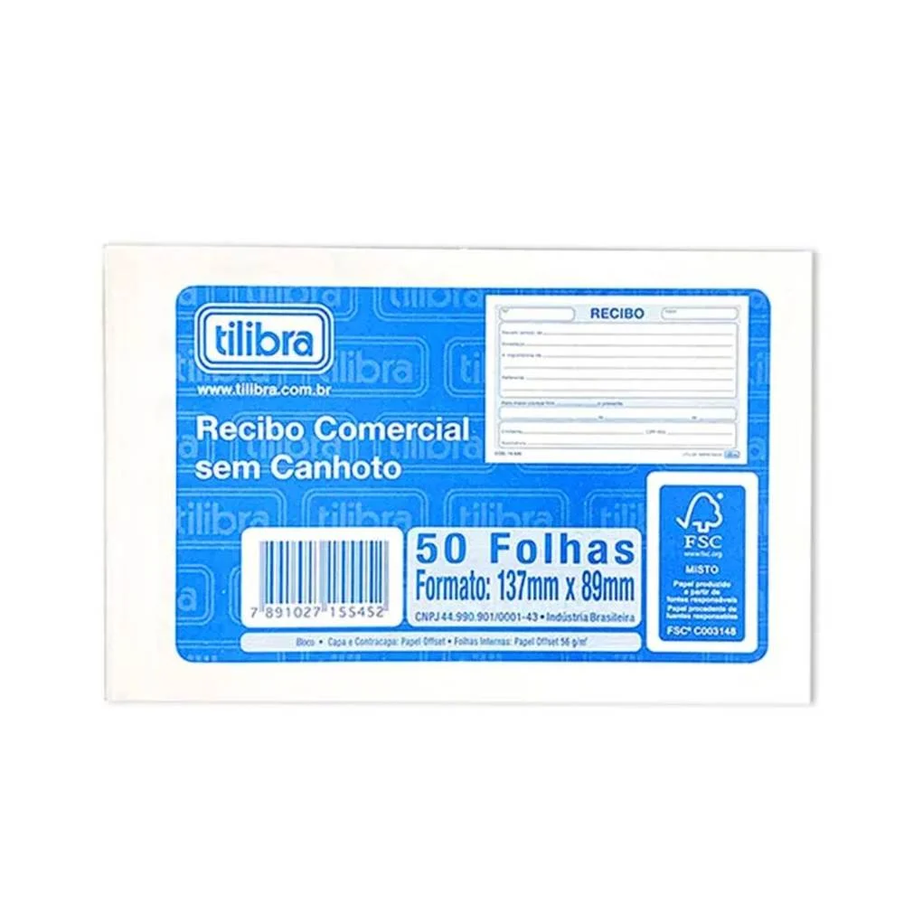

# Projeto: Reconhecimento de Texto e Imagem com Azure Vision

Este projeto demonstra o uso da API do Azure Cognitive Services (Computer Vision) para realizar:

- Extração de texto de imagens (OCR)
- Geração automática de legenda (Caption)
- Reconhecimento facial básico

---

## 📂 Estrutura do projeto
 - 📁 inputs → imagens utilizadas no projeto.
 - 📁 output → resultados extraídos (texto, legendas, etc).
 - 📄 README.md → explicação do processo, prints e insights

 ---

## 🖼️ Imagens usadas

---

## 🔎 Resultados obtidos

